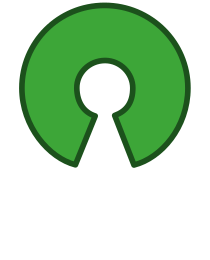

.. VERTEX documentation master file, created by
   sphinx-quickstart on Wed Mar 25 14:22:29 2026.
   You can adapt this file completely to your liking, but it should at least
   contain the root `toctree` directive.

VERTEX Documentation
====================

`ISARIC VERTEX <https://github.com/ISARICResearch/VERTEX>`_ is a web-based application designed for local use by users. It serves as an analysis tool for data captured through our complementary tools, `ISARIC ARC <https://github.com/ISARICResearch/ARC>`_ and `ISARIC BRIDGE <https://github.com/ISARICResearch/BRIDGE>`_.

VERTEX is designed to present graphs and tables based on key relevant research questions that need to be quickly answered during an outbreak. Currently, VERTEX performs descriptive analysis, which can identify the spectrum of clinical features in a disease outbreak. New research questions will be added by the ISARIC team and the wider scientific community, enabling the creation and sharing of additional analysis methods.

VERTEX has three main elements:
  - **Main App**: A map that visually represents the number and country of patients in a `REDCap <https://project-redcap.org>`_ database.
  - **Menu**: A menu containing a series of buttons that open different insight panels.
  - **Insight Panels**: Sets of visuals, each related to specific research questions.

VERTEX processes and visualizes data using the concept of **Reproducible Analytical Pipelines (RAPs)**. RAPs are a set of resusable functions or blocks of code that can request specific variables from an `ARC <https://github.com/ISARICResearch/ARC>`_-formatted REDCap database. These functions then process the data to generate dataframes, which can then be visualized interactively through a Plotly Dash app.

For more detailed instructions on how to use VERTEX please refer to the linked pages below.

VERTEX is licensed under the open source compliant `MIT license <https://opensource.org/license/mit>`_.

.. toctree::
   :maxdepth: 2
   :caption: Contents:

   sources/getting-started
