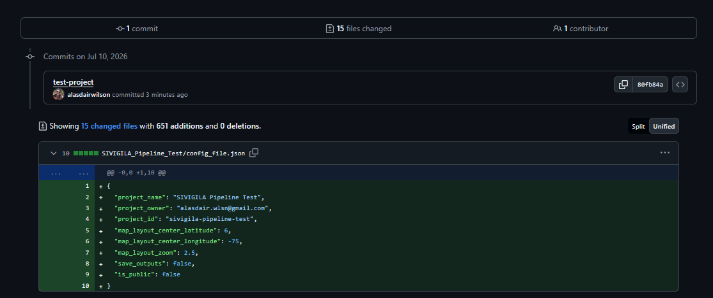
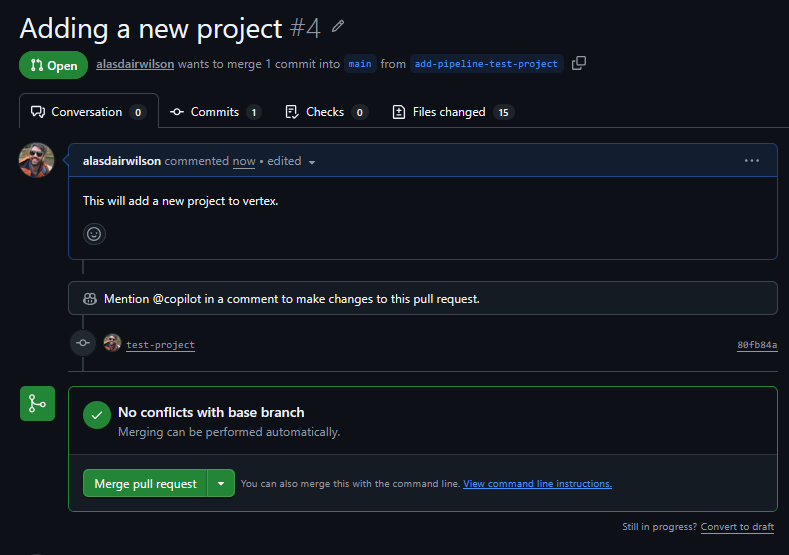
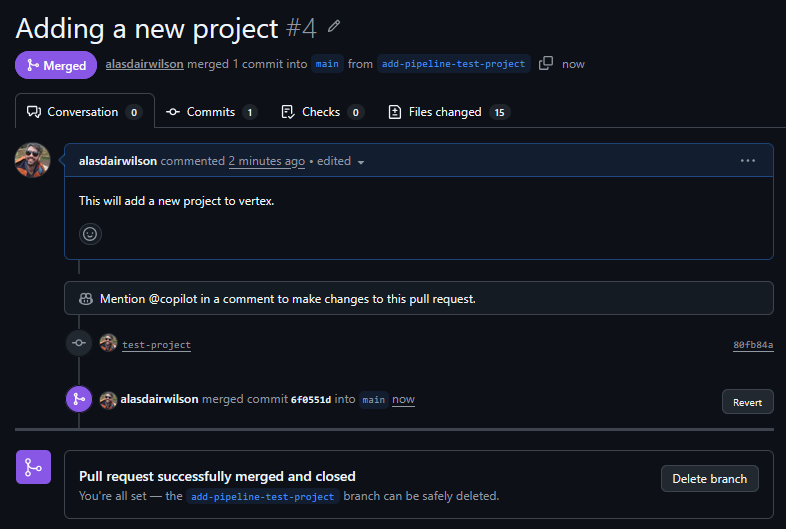
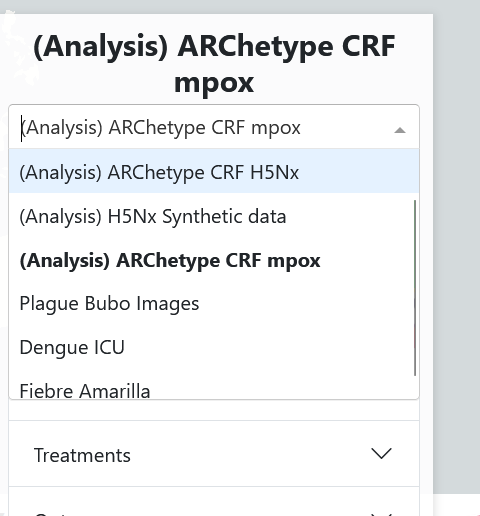
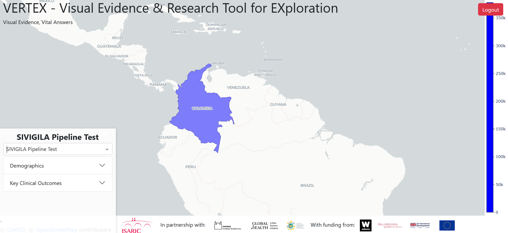
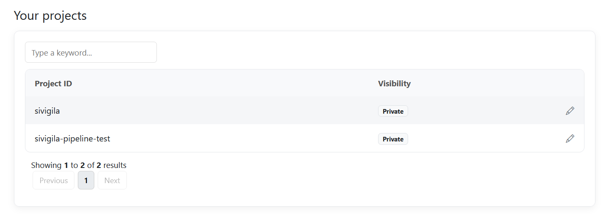
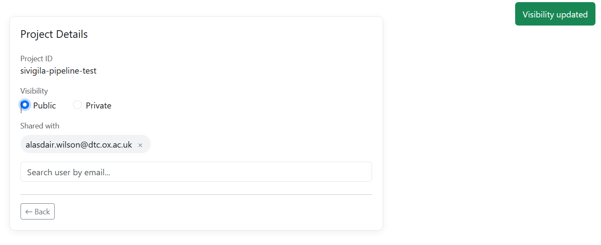
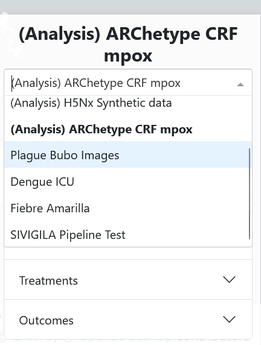

.. _adding-a-project:

Adding a project to VERTEX
--------------------------

This page documents the full pipeline for publishing a new project to the ISARIC VERTEX deployment at `vertex.isaric.org <https://vertex.isaric.org>`_: from creating the project folder in the private `VERTEX-projects <https://github.com/ISARICResearch/VERTEX-projects>`_ repository, through the automated server sync, to managing who can see the project via `account.isaric.org <https://account.isaric.org>`_.

.. _pipeline-overview:

Pipeline overview
~~~~~~~~~~~~~~~~~

.. code:: text

   ┌─────────────────────┐   PR + merge    ┌──────────────────────────┐
   │  VERTEX-projects    │ ──────────────▶│  main branch             │
   └─────────────────────┘                 └────────────┬─────────────┘
                                                        │  hourly cron
                                                        ▼
                                           ┌──────────────────────────┐
                                           │  EC2: git pull to        │
                                           │  /opt/vertex-projects    │
                                           │  + project ingestion     │
                                           └────────────┬─────────────┘
                                                        │  inserts project + owner link
                                                        ▼
                                           ┌──────────────────────────┐
                                           │  RDS access database     │
                                           │  (projects, users,       │
                                           │   user_project_mapping)  │
                                           └──────┬────────────┬──────┘
                                                  │            │
                                     access managed via       visibility on
                                                  ▼            ▼
                                     account.isaric.org   vertex.isaric.org

Project **files** (dashboard data, figures, metadata) are served from the synced copy of the VERTEX-projects repository on the VERTEX server.
Project **access rights** (owner, public/private, shared users) live in the RDS database and are managed through the account webapp.
The config file in the repository only seeds the database entry the first time the project is ingested — after that, access is controlled entirely from `account.isaric.org <https://account.isaric.org>`_.

.. _generate-project-folder:

1. Generate the project folder
~~~~~~~~~~~~~~~~~~~~~~~~~~~~~~

Each project is a top-level folder in the VERTEX-projects repository containing the **public outputs** of a VERTEX analysis — aggregated data and prebuilt figure files only, never raw data.

You do not write this folder by hand. VERTEX generates it from your analysis project — the simplest way is the :doc:`CLI <cli>`:

.. code:: shell

   vertex-cli descriptive-analytics --project-path path/to/your/analysis-project/

This writes the complete static project folder (and PNG exports of every figure) to the project's ``outputs_path`` (:file:`outputs/` by default).

Alternatively, the running dashboard can save the outputs itself: set ``"save_outputs": true`` in your analysis project's :file:`config_file.json`, run VERTEX with the environment variable ``VERTEX_ENABLE_SAVE_OUTPUTS=1`` (both are required, to prevent accidental rewrites of tracked output files), and open the project's dashboard.

The generated folder is what you commit to VERTEX-projects as a new top-level directory:

.. code:: text

   My_Project/
   ├── config_file.json        # generated: project identity + initial access settings
   ├── dashboard_data.csv      # aggregated/summary data for the dashboard
   ├── dashboard_metadata.json # insight panel layout (figures, tables, filters)
   └── <panel folders>/        # one folder per insight panel, containing figure data

.. _project-config-file:

config_file.json
^^^^^^^^^^^^^^^^

Review the generated config before committing — in particular ``project_id`` (must be unique across VERTEX-projects), ``project_owner``, and ``is_public``:

.. code:: json

   {
     "project_name": "SIVIGILA Pipeline Test",
     "project_owner": "owner@example.org",
     "project_id": "sivigila-pipeline-test",
     "map_layout_center_latitude": 6,
     "map_layout_center_longitude": -75,
     "map_layout_zoom": 2.5,
     "save_outputs": false,
     "is_public": false
   }

.. list-table::
   :header-rows: 1
   :widths: 15 15 70

   * - Field
     - Required
     - Notes
   * - ``project_id``
     - yes
     - Unique, stable, kebab-case identifier. This is the primary key used to match the project against the access database (``vertex_id`` column). It must not clash with any existing project and should never be changed after the first ingestion.
   * - ``project_name``
     - recommended
     - Display name shown in VERTEX. Defaults to the folder name if omitted.
   * - ``project_owner``
     - yes (for ingestion)
     - Email address of the owner. **The owner must already have an account on** `account.isaric.org <https://account.isaric.org>`_ — ingestion of a new project fails if this email has no user record, and retries on the next hourly run.
   * - ``is_public``
     - no (defaults to ``true``)
     - Initial visibility. ``false`` means only the owner and explicitly shared users can see the project. **Only read at first ingestion** — change visibility afterwards via the account webapp, not by editing this file.
   * - ``map_layout_*``
     - no
     - Initial map viewport for map panels.

.. _project-pull-request:

2. Open a pull request and merge
~~~~~~~~~~~~~~~~~~~~~~~~~~~~~~~~

Commit the new folder on a branch and open a PR against ``main`` in ``ISARICResearch/VERTEX-projects``.
The diff should contain only your project folder — here the config file plus the dashboard data and figure files:

Once the PR is merged, no further manual action is needed — the server picks the change up automatically.

.. _project-sync-ingestion:

3. Automated server sync and ingestion
~~~~~~~~~~~~~~~~~~~~~~~~~~~~~~~~~~~~~~

An hourly cron job on the VERTEX EC2 instance (at \*:00) does two things:

1. **Sync** — pulls the ``main`` branch of VERTEX-projects into :file:`/opt/vertex-projects` using a read-only deploy key (:file:`scripts/sync_projects_repo.sh` in this repository).
2. **Ingest** — runs :command:`python -m vertex.project_ingestion` inside the running VERTEX container, which scans every project folder and, for each ``project_id`` not yet in the database:

   - looks up the ``project_owner`` email in the ``users`` table (fails for this project if the account does not exist yet — it will be retried every hour),
   - inserts a row into ``projects`` (``vertex_id``, ``owner_id``, ``is_public``), and
   - links the owner in ``user_project_mapping``.

Ingestion is **insert-only and idempotent**: projects already in the database are left untouched, so ownership, visibility, and sharing changes made in the account webapp are never overwritten by subsequent syncs.

Both steps log to :file:`/var/log/vertex-projects-sync.log` on the instance.
A successful run for a new project looks like:

.. code:: text

   [2026-07-10T18:00:01+00:00] Sync started: repo=git@github.com:ISARICResearch/VERTEX-projects.git branch=main dir=/opt/vertex-projects
   [2026-07-10T18:00:03+00:00] Sync finished successfully
   2026-07-10 18:00:05 [INFO] __main__: Static project ingestion summary: seen=5 inserted=1 existing=1 failed=3 owner_links_inserted=1 ...

(``inserted=1`` / ``owner_links_inserted=1`` is the new project; ``failed=3`` here are pre-existing projects whose owner has no account yet; see the troubleshooting table below.)

.. _project-sync-maintainer-notes:

Maintainer notes
^^^^^^^^^^^^^^^^

- The cron definition lives at :file:`/etc/cron.d/vertex-projects-sync` on the instance and is installed by :file:`scripts/install_projects_sync_cron.sh` in this repository.
- To trigger a sync immediately instead of waiting for the top of the hour (via SSM):

  .. code:: shell

     /usr/local/bin/vertex-sync-projects.sh
     docker exec isaric-vertex python -m vertex.project_ingestion --projects-dir /opt/vertex-projects

- Common ingestion errors:

  .. list-table::
     :header-rows: 1
     :widths: 40 30 30

     * - Error
       - Cause
       - Fix
     * - ``owner user does not exist for <email>``
       - ``project_owner`` has no account
       - Owner signs up at account.isaric.org; ingestion retries hourly
     * - ``config_file.json is missing project_owner``
       - Field absent/empty
       - Add the field and merge a fix
     * - ``Skipping folder without config_file.json``
       - Folder has no config
       - Add a config file (folders without one are ignored, not errors)

.. _project-view-vertex:

4. View the project in VERTEX
~~~~~~~~~~~~~~~~~~~~~~~~~~~~~

On `vertex.isaric.org <https://vertex.isaric.org>`_:

- **Public** projects are visible to everyone, logged in or not.
- **Private** projects are visible only to the owner and shared users, owners will always be able to see the project after logging in with the same account used on account.isaric.org.

Because this project was ingested with ``is_public: false``, it does not appear in the project selector for anyone else — the other (public) projects are listed, but the new one is absent:

Logged in as the owner, the project is available and opens like any other dashboard:

.. _project-manage-access:

5. Manage access from the account webapp
~~~~~~~~~~~~~~~~~~~~~~~~~~~~~~~~~~~~~~~~

Once ingested, the project appears for the owner on `account.isaric.org <https://account.isaric.org>`_ under **Your projects**, with its current visibility:

Opening a project's details page (pencil icon) lets the owner:

- **Share with individual users** — search accounts by email and add or remove them. Shared users can open the project in VERTEX while it stays private to everyone else.
- **Toggle visibility** between Public and Private.

Here the project has been shared with a second account and then switched to Public:

Access checks happen at page load: there is no extra sync delay, because both applications read the same access database.
After the switch to Public above, the project immediately shows up in the VERTEX project selector without logging in:

.. _removing-a-project:

Removing a project
~~~~~~~~~~~~~~~~~~

**Do not simply delete the project folder.**
Instead, merge a PR that empties it, leaving only a :file:`delete.txt` marker that records the retired ``project_id``:

.. code:: text

   My_Project/
   └── delete.txt

with contents along the lines of:

.. code:: text

   Project "My Project" (project_id: my-project) has been removed from VERTEX-projects.
   This folder name and project_id are retired and must not be reused.

A folder without a :file:`config_file.json` is ignored by both the VERTEX app and ingestion, so the project disappears from `vertex.isaric.org <https://vertex.isaric.org>`_ at the next hourly sync.

A maintainer should then delete the project's ``user_project_mapping`` rows and its ``projects`` row (matched on ``vertex_id``) from the access database.
This removes the project from account.isaric.org and guarantees no new project can ever inherit the removed project's owner, visibility, or shared users.

The retired folder is the permanent record that its name and ``project_id`` are taken — the id only existed in the deleted :file:`config_file.json`, hence writing it into :file:`delete.txt` for posterity.
Neither should be reused: VERTEX share links identify projects as ``?project=<project_id>``, but fall back to folder, so a new project reusing either would capture links to the removed project.
Reviewers of PRs adding new projects should check the new id against the retired folders.
